# Step-by-step report on the model predicting debt defaults

This document describes the step-by-step processing of the training dataset and the analysis of the test dataset.

## Stage 1. Handling outliers by columns

### Annual Income

**Original statistics:**

```
count    5,943
mean     1,366,391.72
std      845,339.20
min      164,597.00
25%      844,341.00
50%      1,168,386.00
75%      1,640,137.00
max      10,149,344.00
```

- Number of outliers (IQR): 287 (4.83%)
- Normal range by IQR: [-349353.0, 2833831.0]


**Processing:**

Method: capping at 99th percentile

- 99th percentile used for capping: 4517246.58

**Statistics after processing:**

```
count    5,943
mean     1,349,432.52
std      747,137.69
min      164,597.00
25%      844,341.00
50%      1,168,386.00
75%      1,640,137.00
max      4,517,246.58
```

- Number of outliers (IQR) after: 287 (4.83%)
- Normal range by IQR after: [-349353.0, 2833831.0]

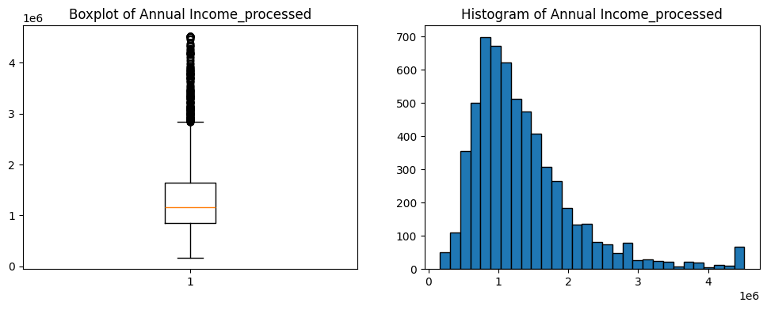

---

### Credit Score

**Original statistics:**

```
count    5,943
mean     1,151.09
std      1,604.45
min      585.00
25%      711.00
50%      731.00
75%      743.00
max      7,510.00
```

- Number of outliers (IQR): 662 (11.14%)
- Normal range by IQR: [663.0, 791.0]

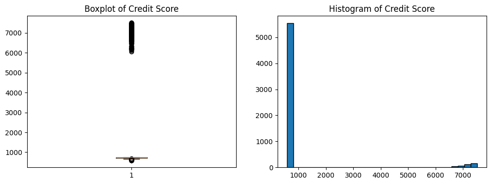

**Processing:**

Method: remove invalid + cap by IQR upper bound

**Statistics after processing:**

```
count    5,543
mean     720.71
std      27.65
min      585.00
25%      709.00
50%      729.00
75%      741.00
max      751.00
```

- Number of outliers (IQR) after: 251 (4.53%)
- Normal range by IQR after: [661.0, 789.0]

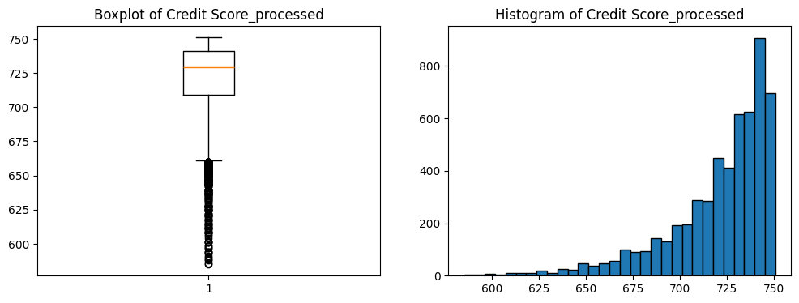

---

### Number of Credit Problems

**Original statistics:**

```
count    7,500
mean     0.17
std      0.50
min      0.00
25%      0.00
50%      0.00
75%      0.00
max      7.00
```

- Number of outliers (IQR): 1031 (13.75%)
- Normal range by IQR: [0.0, 0.0]


**Processing:**

Method: categorized: 0, 1, 2+

**Statistics after processing:**

```
count    7,500
mean     0.16
std      0.42
min      0.00
25%      0.00
50%      0.00
75%      0.00
max      2.00
```

- Number of outliers (IQR) after: 1031 (13.75%)
- Normal range by IQR after: [0.0, 0.0]

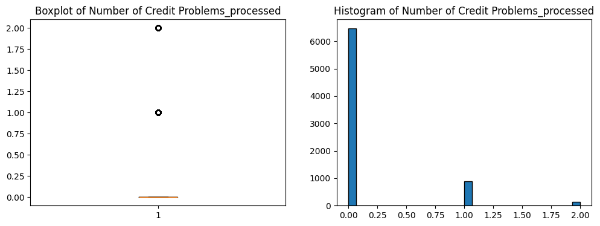

---

### Months since last delinquent

**Original statistics:**

```
count    3,419
mean     34.69
std      21.69
min      0.00
25%      16.00
50%      32.00
75%      50.00
max      118.00
```

- Number of outliers (IQR): 1 (0.03%)
- Normal range by IQR: [-35.0, 101.0]


**Processing:**

Method: capping by upper IQR bound (outliers only), NaNs untouched

**Statistics after processing:**

```
count    3,419
mean     34.69
std      21.67
min      0.00
25%      16.00
50%      32.00
75%      50.00
max      101.00
```

- Number of outliers (IQR) after: 0 (0.0%)
- Normal range by IQR after: [-35.0, 101.0]

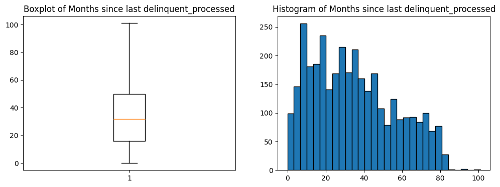

---

### Bankruptcies

**Original statistics:**

```
count    7,486
mean     0.12
std      0.35
min      0.00
25%      0.00
50%      0.00
75%      0.00
max      4.00
```

- Number of outliers (IQR): 826 (11.03%)
- Normal range by IQR: [0.0, 0.0]


**Processing:**

Method: categorized: 0, 1, 2+

**Statistics after processing:**

```
count    7,486
mean     0.12
std      0.34
min      0.00
25%      0.00
50%      0.00
75%      0.00
max      2.00
```

- Number of outliers (IQR) after: 826 (11.03%)
- Normal range by IQR after: [0.0, 0.0]

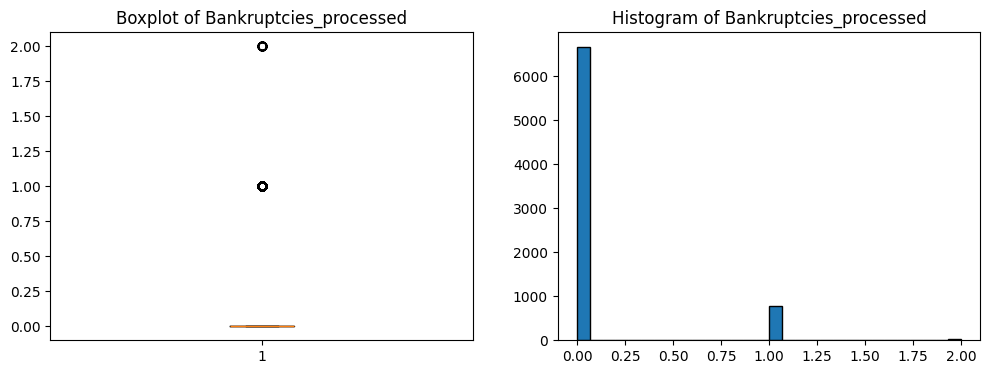

---

### Tax Liens

**Original statistics:**

```
count    7,500
mean     0.03
std      0.27
min      0.00
25%      0.00
50%      0.00
75%      0.00
max      7.00
```

- Number of outliers (IQR): 134 (1.79%)
- Normal range by IQR: [0.0, 0.0]


**Processing:**

Method: categorized: 0, 1, 2+

**Statistics after processing:**

```
count    7,500
mean     0.02
std      0.19
min      0.00
25%      0.00
50%      0.00
75%      0.00
max      2.00
```

- Number of outliers (IQR) after: 134 (1.79%)
- Normal range by IQR after: [0.0, 0.0]


---

### Monthly Debt

**Original statistics:**

```
count    7,500
mean     18,314.45
std      11,926.76
min      0.00
25%      10,067.50
50%      16,076.50
75%      23,818.00
max      136,679.00
```

- Number of outliers (IQR): 255 (3.4%)
- Normal range by IQR: [-10558.25, 44443.75]

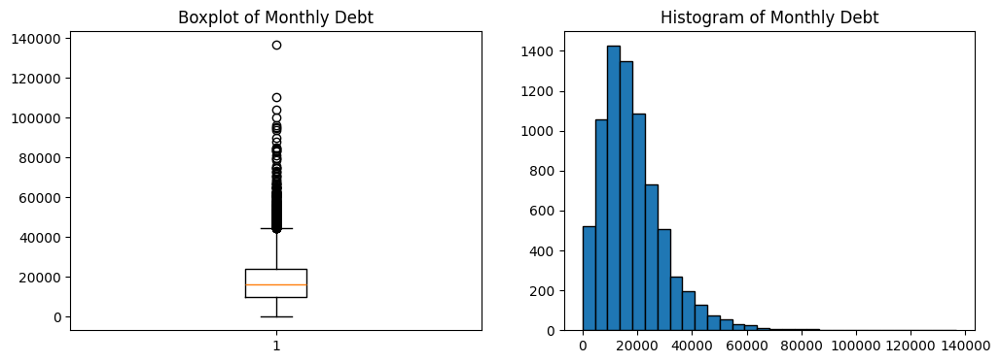

**Processing:**

Method: capping at 99th percentile

- 99th percentile used for capping: 58113.13

**Statistics after processing:**

```
count    7,500
mean     18,177.85
std      11,287.21
min      0.00
25%      10,067.50
50%      16,076.50
75%      23,818.00
max      58,113.13
```

- Number of outliers (IQR) after: 255 (3.4%)
- Normal range by IQR after: [-10558.25, 44443.75]


---

### Current Loan Amount

**Original statistics:**

```
count    7,500
mean     11,873,177.45
std      31,926,122.97
min      11,242.00
25%      180,169.00
50%      309,573.00
75%      519,882.00
max      99,999,999.00
```

- Number of outliers (IQR): 870 (11.6%)
- Normal range by IQR: [-329400.5, 1029451.5]

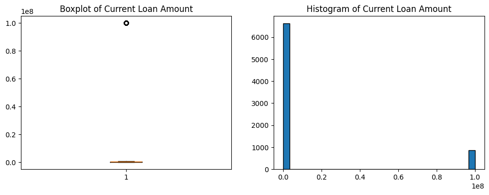

**Processing:**

Method: replace 99999999 with NaN, then cap by IQR upper bound

**Statistics after processing:**

```
count    6,630
mean     309,024.39
std      182,294.01
min      11,242.00
25%      172,744.00
50%      265,826.00
75%      430,100.00
max      789,030.00
```

- Number of outliers (IQR) after: 0 (0.0%)
- Normal range by IQR after: [-213290.0, 816134.0]


---

### Current Credit Balance

**Original statistics:**

```
count    7,500
mean     289,833.24
std      317,871.38
min      0.00
25%      114,256.50
50%      209,323.00
75%      360,406.25
max      6,506,797.00
```

- Number of outliers (IQR): 440 (5.87%)
- Normal range by IQR: [-254968.12, 729630.88]


**Processing:**

Method: capping at 99th percentile

- 99th percentile used for capping: 1483079.39

**Statistics after processing:**

```
count    7,500
mean     281,280.42
std      255,408.24
min      0.00
25%      114,256.50
50%      209,323.00
75%      360,406.25
max      1,483,079.39
```

- Number of outliers (IQR) after: 440 (5.87%)
- Normal range by IQR after: [-254968.12, 729630.88]


---

### Maximum Open Credit

**Original statistics:**

```
count    7,500
mean     945,153.73
std      16,026,216.67
min      0.00
25%      279,229.50
50%      478,159.00
75%      793,501.50
max      1,304,726,170.00
```

- Number of outliers (IQR): 466 (6.21%)
- Normal range by IQR: [-492178.5, 1564909.5]

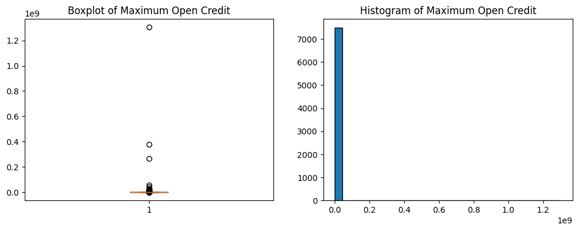

**Processing:**

Method: capping at 99th percentile

- 99th percentile used for capping: 3568459.4

**Statistics after processing:**

```
count    7,500
mean     634,656.12
std      566,150.46
min      0.00
25%      279,229.50
50%      478,159.00
75%      793,501.50
max      3,568,459.40
```

- Number of outliers (IQR) after: 466 (6.21%)
- Normal range by IQR after: [-492178.5, 1564909.5]


---

### Number of Open Accounts

**Original statistics:**

```
count    7,500
mean     11.13
std      4.91
min      2.00
25%      8.00
50%      10.00
75%      14.00
max      43.00
```

- Number of outliers (IQR): 170 (2.27%)
- Normal range by IQR: [-1.0, 23.0]


**Processing:**

Method: capping by upper IQR bound (outliers only), NaNs untouched

**Statistics after processing:**

```
count    7,500
mean     11.04
std      4.60
min      2.00
25%      8.00
50%      10.00
75%      14.00
max      23.00
```

- Number of outliers (IQR) after: 0 (0.0%)
- Normal range by IQR after: [-1.0, 23.0]

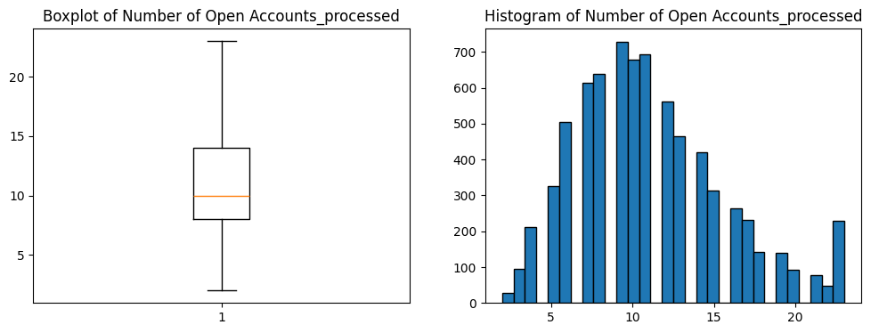

---

### Years of Credit History

**Original statistics:**

```
count    7,500
mean     18.32
std      7.04
min      4.00
25%      13.50
50%      17.00
75%      21.80
max      57.70
```

- Number of outliers (IQR): 228 (3.04%)
- Normal range by IQR: [1.05, 34.25]

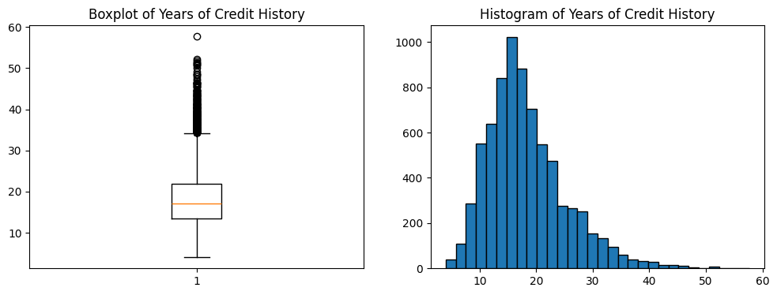

**Processing:**

Method: capping by upper IQR bound (outliers only), NaNs untouched

**Statistics after processing:**

```
count    7,500
mean     18.16
std      6.57
min      4.00
25%      13.50
50%      17.00
75%      21.80
max      34.25
```

- Number of outliers (IQR) after: 0 (0.0%)
- Normal range by IQR after: [1.05, 34.25]


---

### Years in current job

**Original statistics:**

```
count    7,129
mean     5.92
std      3.56
min      0.50
25%      3.00
50%      6.00
75%      10.00
max      10.00
```

- Number of outliers (IQR): 0 (0.0%)
- Normal range by IQR: [-7.5, 20.5]

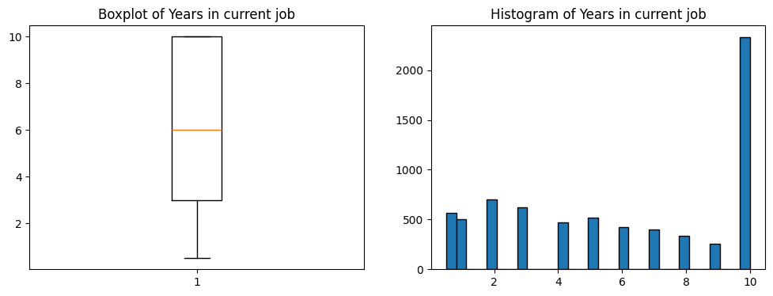

**Processing:**

Method: capping by upper IQR bound (outliers only), NaNs untouched

**Statistics after processing:**

```
count    7,129
mean     5.92
std      3.56
min      0.50
25%      3.00
50%      6.00
75%      10.00
max      10.00
```

- Number of outliers (IQR) after: 0 (0.0%)
- Normal range by IQR after: [-7.5, 20.5]


---


## Stage 2. Encoding Categorical Features

The following categorical features were one-hot encoded:
- Home Ownership
- Purpose
- Term

Number of new dummy columns created: 21
Original categorical columns were removed.
No missing values were present in these columns.

## Stage 3. Handling Missing Values in Numeric Features

Missing values in the following processed columns were filled with the median:
- Annual Income_processed: median = 1168386.00
- Credit Score_processed: median = 729.00
- Months since last delinquent_processed: median = 32.00
- Bankruptcies_processed: median = 0.00
- Current Loan Amount_processed: median = 265826.00
- Years in current job_processed: median = 6.00

## Stage 4. Feature Selection and Analysis

### 4.1 Correlation with Target Variable

Correlation with Credit Default shows linear relationships:

**Features increasing default risk (positive correlation):**

- Term_Long Term: 0.181
- Current Loan Amount_processed: 0.082
- Home Ownership_Rent: 0.060
- Purpose_business loan: 0.043
- Purpose_small business: 0.034
- Tax Liens_processed: 0.030
- Number of Open Accounts_processed: 0.029
- Purpose_renewable energy: 0.026
- Monthly Debt_processed: 0.019
- Number of Credit Problems_processed: 0.016

**Features decreasing default risk (negative correlation):**

- Purpose_home improvements: -0.011
- Current Credit Balance_processed: -0.011
- Purpose_educational expenses: -0.015
- Purpose_debt consolidation: -0.015
- Years of Credit History_processed: -0.024
- Home Ownership_Home Mortgage: -0.064
- Maximum Open Credit_processed: -0.070
- Annual Income_processed: -0.101
- Credit Score_processed: -0.116
- Term_Short Term: -0.181

### 4.2 Feature Importance (Random Forest)

Random Forest captures non-linear relationships and shows the most predictive features:

**Top 20 most important features:**

8. **Current Loan Amount_processed**: 0.1175
2. **Credit Score_processed**: 0.1167
1. **Annual Income_processed**: 0.0986
10. **Maximum Open Credit_processed**: 0.0966
9. **Current Credit Balance_processed**: 0.0956
7. **Monthly Debt_processed**: 0.0928
12. **Years of Credit History_processed**: 0.0914
11. **Number of Open Accounts_processed**: 0.0671
4. **Months since last delinquent_processed**: 0.0588
13. **Years in current job_processed**: 0.0501
34. **Term_Short Term**: 0.0146
33. **Term_Long Term**: 0.0146
3. **Number of Credit Problems_processed**: 0.0104
17. **Home Ownership_Rent**: 0.0100
21. **Purpose_debt consolidation**: 0.0099
15. **Home Ownership_Home Mortgage**: 0.0095
5. **Bankruptcies_processed**: 0.0080
27. **Purpose_other**: 0.0075
16. **Home Ownership_Own Home**: 0.0070
23. **Purpose_home improvements**: 0.0051

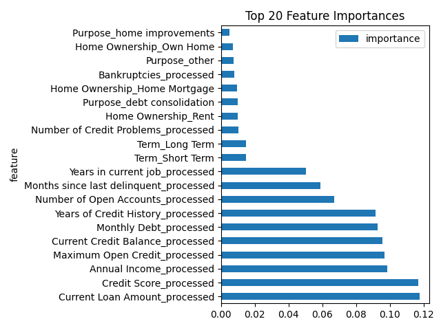


### 4.3 Feature Selection Process

**Step 1:** Filter by importance threshold (> 0.02)
- Initial number of features: 34
- Features above threshold: 10

**Step 2:** Remove duplicate features (correlation > 0.8)
- Features after removing duplicates: 10

### 4.4 Final Selected Features

The following features will be used for modeling:

1. **Annual Income_processed**  
   - Importance: 0.0986  
   - Correlation: -0.101 ( decreases risk)  

2. **Credit Score_processed**  
   - Importance: 0.1167  
   - Correlation: -0.116 ( decreases risk)  

3. **Months since last delinquent_processed**  
   - Importance: 0.0588  
   - Correlation: 0.003 ( increases risk)  

4. **Monthly Debt_processed**  
   - Importance: 0.0928  
   - Correlation: 0.019 ( increases risk)  

5. **Current Loan Amount_processed**  
   - Importance: 0.1175  
   - Correlation: 0.082 ( increases risk)  

6. **Current Credit Balance_processed**  
   - Importance: 0.0956  
   - Correlation: -0.011 ( decreases risk)  

7. **Maximum Open Credit_processed**  
   - Importance: 0.0966  
   - Correlation: -0.070 ( decreases risk)  

8. **Number of Open Accounts_processed**  
   - Importance: 0.0671  
   - Correlation: 0.029 ( increases risk)  

9. **Years of Credit History_processed**  
   - Importance: 0.0914  
   - Correlation: -0.024 ( decreases risk)  

10. **Years in current job_processed**  
   - Importance: 0.0501  
   - Correlation: -0.004 ( decreases risk)  


## Stage 5. Model Training and Evaluation

Data split: 80% train / 20% validation (stratified).

- **Train size**: 6000
- **Validation size**: 1500
- **Train default rate**: 28.17%
- **Validation default rate**: 28.20%

### 5.1 Logistic Regression
```python
lr = LogisticRegression(class_weight='balanced')
```
- **F1-score**: 0.4545
- Precision: 0.35 | Recall: 0.64

### 5.2 Random Forest
```python
rf = RandomForestClassifier(class_weight='balanced')
```
- **F1-score**: 0.4000
- **Precision**: 0.69 | **Recall**: 0.28

### 5.3 XGBoost (Best Model)
```python
xgb = XGBClassifier(scale_pos_weight=3.5, max_depth=3, learning_rate=0.05)
```
- **F1-score**: **0.5151** (> 0.5)
- **Precision**: 0.38 | **Recall**: 0.79

### 5.4 Summary
| Model                 |  F1-score  | Precision | Recall |
|-----------------------|------------|-----------|--------|
| Logistic Regression   | 0.4545     | 0.35      | 0.64   |
| Random Forest         | 0.4000     | 0.69      | 0.28   |
| **XGBoost**           | **0.5151** | 0.38      | 0.79   |

**XGBoost selected as final model** — best balance of precision/recall and meets the F1 > 0.5 requirement.

## Stage 6. Model Validation

### 6.1 Cross-Validation (10-fold)

- **F1 scores for each fold**: [np.float64(0.5531), np.float64(0.5294), np.float64(0.5348), np.float64(0.5255), np.float64(0.5387), np.float64(0.5258), np.float64(0.5181), np.float64(0.5422), np.float64(0.526), np.float64(0.5134)]
- **Mean F1**: 0.5307
- **Standard Deviation**: 0.0112

### 6.2 Overfitting Check

- **Train F1**: 0.5762
- **Validation F1**: 0.5151
- **Difference**: 0.0611

### 6.3 Conclusion

 **No significant overfitting detected** — the model generalizes well.

The model shows stable performance across all folds (std = 0.0112) and meets the F1 > 0.5 requirement.

## Stage 7. Feature Interpretation

### 7.1 Top 10 Important Features

| Feature | Importance |
|:--------|-----------:|
| Credit Score_processed | 0.2605 |
| Current Loan Amount_processed | 0.2406 |
| Annual Income_processed | 0.1391 |
| Years in current job_processed | 0.0560 |
| Maximum Open Credit_processed | 0.0557 |
| Monthly Debt_processed | 0.0532 |
| Number of Open Accounts_processed | 0.0527 |
| Current Credit Balance_processed | 0.0493 |
| Months since last delinquent_processed | 0.0479 |
| Years of Credit History_processed | 0.0450 |


### 7.2 Key Insights

**Top 3 features account for 64.02% of total importance:**

- **Credit Score_processed**: 26.05%
- **Current Loan Amount_processed**: 24.06%
- **Annual Income_processed**: 13.91%

### 7.3 Visualization


### 7.4 Business Logic

The model's top features align with real-world credit risk assessment:
- Credit Score (lower score → higher risk)
- Current Loan Amount (larger loans → higher exposure)
- Annual Income (higher income → better repayment ability)

 **Model is interpretable and uses meaningful features**

## Stage 8. Final Results

### 8.1 Test Dataset Predictions

- **Total predictions**: 2500
- **Predicted defaults (class 1)**: 1487 (59.5%)
- **Predicted non-defaults (class 0)**: 1013 (40.5%)

### 8.2 Final Model Performance Summary

| Metric | Value |
|:--------|-------:|
| Best Model | XGBoost |
| F1-score (validation) | 0.5151 |
| Cross-validation F1 (10-fold) | 0.5307 ± 0.0112 |
| Train F1 | 0.5762 |
| Validation F1 | 0.5151 |

### 8.3 Conclusion

1. F1-score > 0.5 achieved: **0.5151**
2. Complete ML pipeline implemented (EDA, preprocessing, feature engineering, modeling)
3. Model is interpretable with Credit Score as the most important feature

## BONUS: Custom Logistic Regression vs LinearRegression

### Implementation Results

| Model | F1-score | Note |
|:------|---------:|:-----|
| Custom Logistic Regression | 0.4450 | Implemented with gradient descent |
| sklearn LinearRegression | 0.0499 |  Wrong model for classification |
| sklearn LogisticRegression | 0.4545 |  Reference implementation |
| XGBoost (best) | 0.5151 |  Final project model |

